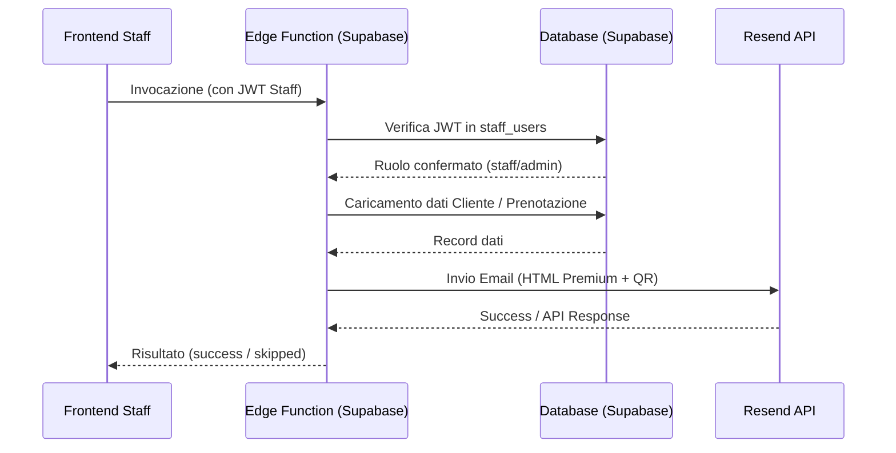

# Design Spec: Integrazione Email Fior d'Acqua VIP Club

> Data: 2026-06-27  
> Autore: Antigravity  
> Stato: Approvato  

Questo documento specifica l'integrazione e il completamento delle email automatiche del sistema VIP (Welcome Email ed Email Conferma Prenotazione con QR) utilizzando le Edge Functions di Supabase e il provider Resend.

---

## 1. Architettura e Sicurezza

### 1.1 Autenticazione delle Edge Functions
Le chiamate alle Edge Functions avvengono in due contesti diversi:
1. **Contesto Cliente (Anonimo)**: Il cliente effettua una prenotazione e richiede l'email. Non ha un account Supabase Auth. Invia un token UUID in `sessionStorage` (presente nella tabella `client_sessions`). L'Edge Function valida questo token.
2. **Contesto Staff (Autenticato)**: Lo staff crea/approva profili o conferma prenotazioni. Has una sessione Supabase Auth valida. L'Edge Function estrae il JWT dall'header `Authorization`, verifica l'identità dell'utente e controlla che sia registrato come `staff`/`admin` nella tabella `staff_users`.

Questo design garantisce che:
- Nessuna chiave `service_role` o segreto Resend venga mai esposto nel frontend.
- Le operazioni riservate siano accessibili solo dallo staff autorizzato.

### 1.2 Flusso dei Dati


---

## 2. Nuova Edge Function: `vip-profile-email`

Viene creata una nuova Edge Function sotto `supabase/functions/vip-profile-email/index.ts`.

### 2.1 Payload Richiesta
```json
{
  "client_id": "UUID_DEL_CLIENTE"
}
```

### 2.2 Autenticazione
La funzione recupera l'header `Authorization`. Se il token è valido e l'utente corrisponde a un record attivo in `staff_users`, la richiesta procede. Altrimenti restituisce `401 Unauthorized`.

### 2.3 Template Email (Stile Premium Editoriale)
L'HTML dell'email è curato editorialmente e varia lo stile visivo in base al livello VIP del membro:
- **SILVER**: Tema sobrio grigio/navy con badge argento.
- **GOLD**: Tema raffinato crema/oro con badge dorato.
- **BLACK**: Tema minimalista scuro con badge nero.

L'email contiene:
- Nome e cognome del cliente.
- Livello VIP.
- Codice Card Digitale (es. `FDA-2026-XXXXXX`).
- Pulsante di accesso che reindirizza a `PUBLIC_SITE_URL + "/vip-login.html"`.
- Nessun dato sensibile (password, telefono, ecc.).

---

## 3. Aggiornamento Edge Function: `vip-booking-email`

La funzione esistente viene modificata per supportare:
1. **Autenticazione Ibrida**: Consente l'invocazione sia tramite session token del cliente sia tramite JWT dello staff.
2. **Template Dinamico**:
   - Se lo stato della prenotazione è `RICHIESTA`, mostra un avviso che la prenotazione è in attesa di approvazione.
   - Se lo stato è `CONFERMATA`, mostra un messaggio di avvenuta conferma e invita a mostrare il QR code al check-in.
3. **QR Code**: Il QR punta al link di check-in dello staff: `PUBLIC_SITE_URL + "/vip-checkin.html?booking=<BOOKING_ID>&date=<YYYY-MM-DD>"`.

---

## 4. Integrazione Frontend

### 4.1 Modifiche a `vip-verify.html`
Aggiunta del pulsante per l'invio manuale dell'email di benvenuto all'interno del form clienti:
```html
<button class="vip-btn vip-btn-plain" id="vipAdminSendWelcomeEmailButton" type="button" style="display: none;">Invia email benvenuto</button>
```

### 4.2 Modifiche a `vip-admin-form.js`
- **Mostra/Nascondi Pulsante**: Gestito in `populateForm` e `resetForm`. Il pulsante appare solo se il cliente caricato è in stato `APPROVATO` o `VIP` e possiede un indirizzo email.
- **Invio Manuale**: Al click, disabilita il pulsante, invoca `vip-profile-email` e mostra l'esito nel box di stato del form.
- **Invio Automatico**: In `onSubmit`, se il cliente viene creato come `APPROVATO`/`VIP`, oppure se lo stato di un cliente esistente passa da un altro valore a `APPROVATO`/`VIP`, invoca automaticamente l'Edge Function in background e notifica l'utente dell'esito.

### 4.3 Modifiche a `vip-admin-clients.js`
- **Bulk Action**: Nella funzione di aggiornamento bulk dello stato, se lo stato viene impostato a `APPROVATO` o `VIP` per clienti selezionati, richiama in background l'Edge Function `vip-profile-email` per ciascun cliente che possiede un indirizzo email.

### 4.4 Modifiche a `vip-admin-bookings.js`
- In `updateBookingStatus`, se lo staff cambia lo stato a `CONFERMATA`, invoca l'Edge Function `vip-booking-email` passando il `booking_id` per notificare immediatamente il cliente via email con il QR code aggiornato.

---

## 5. Variabili d'Ambiente e Configurazione Resend

Le Edge Functions richiedono le seguenti variabili in Supabase:
- `SUPABASE_SERVICE_ROLE_KEY` o `SUPABASE_SECRET_KEYS` (inserite automaticamente da Supabase).
- `RESEND_API_KEY`: Chiave API ottenuta dal pannello Resend.
- `BOOKING_EMAIL_FROM`: Indirizzo mittente autorizzato su Resend (es. `Fior d'Acqua VIP Club <vip@fiordacquaclub.it>`).
- `PUBLIC_SITE_URL`: Dominio pubblico di produzione (es. `https://rebranding-playa.vercel.app`).
